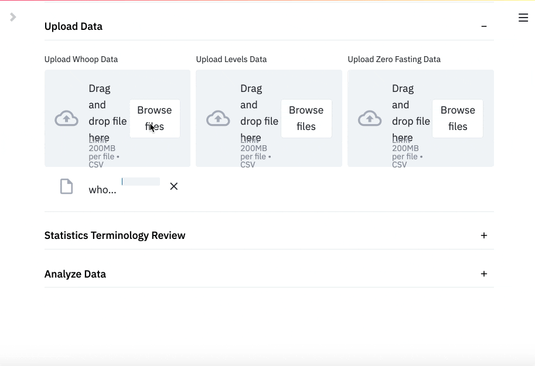

# Metabolic Health and Lifestyle Metrics Cross Analysis

As you actively work on your metabolic fitness, 
it's important to understand the impact of environmental variables, not just nutrition.

[This application](https://share.streamlit.io/jbpauly/glucose-sleep-analysis/main/src/app.py)
allows you to upload your Levels, Zero Fasting, and Whoop data and analyze the results for yourself.



## Try it out!
1. Log your Levels Metabolic Scores and Save as a CSV ([view template](https://docs.google.com/spreadsheets/d/1uqkZBKDaJqoXVy18jEXOv94Dx00D-X_etJEz_IFvV6M/edit?usp=sharing))
    - Two Columns: Date, Metabolic Score
    - Descending by date (oldest to newest)
    - Save as a CSV file
2. Export Zero Fasting Log and re-save as a CSV
    - In app instructions 
        - Me (lower right) -> Settings (upper right) -> My Data -> Export Data
    - Check if file exports as a TXT or CSV file and re-save as a CSV if necessary
3. Download your [Whoop sleep summary data](https://docs.google.com/spreadsheets/d/1q9tU4tkBLUi6oFsdLsO9HnOuMC-TEkrBXNoNXvLQt3Q/edit#gid=1913656685)
    - Follow the [How To video](https://www.youtube.com/watch?v=x19G39cXkoM)
    - Download **only** the 'Whoop' sheet as a CSV
4. Upload your data

#### Learn more about the [Whoop api](https://github.com/pelo-tech/whoop-api-spec)
Thank you [Pelo-Tech](https://github.com/pelo-tech) and [DovOps](https://github.com/DovOps)
for creating the api and GUI!

## How to run in your own environment
The app requires Python 3.7. **Create a new virtual environment**, then run:

```
git clone https://github.com/jbpauly/glucose-sleep-analysis.git
cd glucose-sleep-analysis
pip install -r requirements.txt
cd src
streamlit run main.py
```

## Roadmap
1. Close out code coverage with tests
2. Enhance Zero module to work with 24+ hour long fasts
3. Add 'data pruning' functionality
3. Add confidence intervals to regression lines
4. Create a 'binning' function and functionality to bin any continuous variable 
5. Integrate with [whoop-api-spec](https://github.com/pelo-tech/whoop-api-spec) 
so users can request Whoop sleep data directly from app instead using the [google-sheet GUI](https://docs.google.com/spreadsheets/d/1q9tU4tkBLUi6oFsdLsO9HnOuMC-TEkrBXNoNXvLQt3Q/edit#gid=1913656685)
6. Add functionality with other datasets / sources (if requested).

## Questions, comments, or suggestions?
This app new and will likely break at some point. 
It has not be tested with a large number of unique datasets,
Please let me know if you run into problems by submitting an [Issue](https://github.com/jbpauly/glucose-sleep-analysis/issues)
